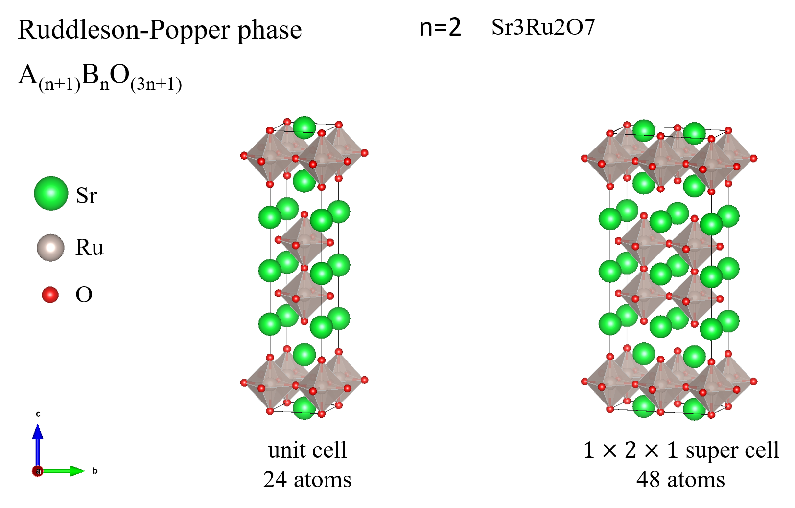
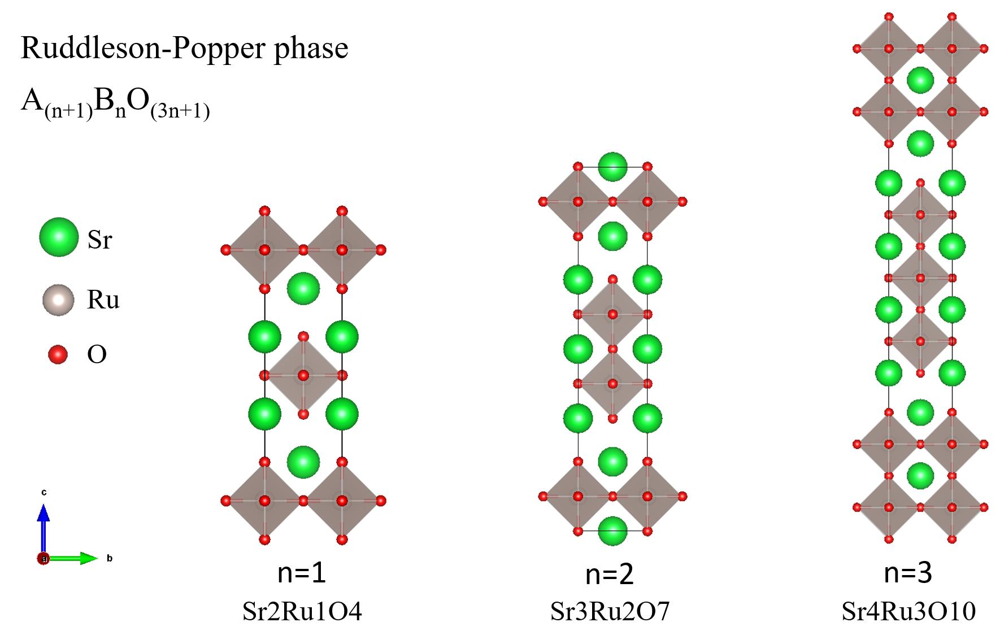
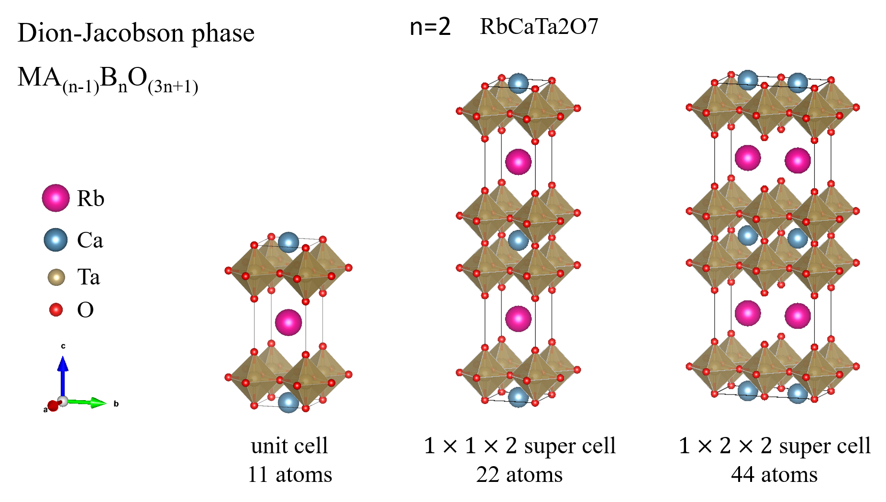
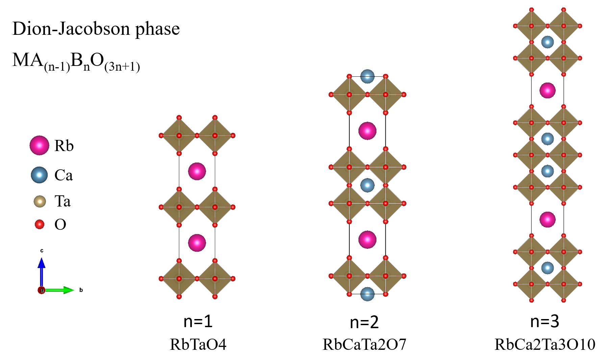

# Dion-Jacobson and Ruddleson-Popper phases

The Dion-Jacobson phase and Ruddleson-Popper phase are two derivatives of cubic perovskite structure. 

[Perovskite Structure and Derivatives](https://www.princeton.edu/~cavalab/tutorials/public/structures/perovskites.html) is a good reference to understand these structures.

## Usage

These python scripts generate POSCARs for Dion-Jacobson Phase $M^{+1}A_{(n-1)}B_nO_{(3n+1)}$ and Ruddleson-Popper Phase $A_{(n+1)}B_nO_{(3n+1)}$.

Usage:

```bash
$ python3 RP_structure.py A B O n
$ python3 DJ_structure.py M A B O n 
```

where `A`, `B`, `O` is chemical elements and `n` is the number of layers.

## Example

Using the command below, you can generate a VASP POSCAR for Sr3Ru2O7.

```bash
$ python3 RP_structure.py Sr Ru O 3
```



Changing `n` from `1` to `3`, we can generate RP phase structure from 1 layer to 3 layers.



Using the command below, you can generate a VASP POSCAR for RbCaTa2O7.

```bash
$ python3 DJ_structure.py Rb Ca Ta O 2
```



Changing `n` from `1` to `3`, we can generate DJ phase structure from 1 layer to 3 layers. The figure below shows the $1\times 1\times 2$ supercells.



## Reference

- [Cava Lab: Perovskite Structure and Derivatives](https://www.princeton.edu/~cavalab/tutorials/public/structures/perovskites.html)

- [wikipedia: Ruddlesden-Popper phase](https://en.wikipedia.org/wiki/Ruddlesden-Popper_phase)